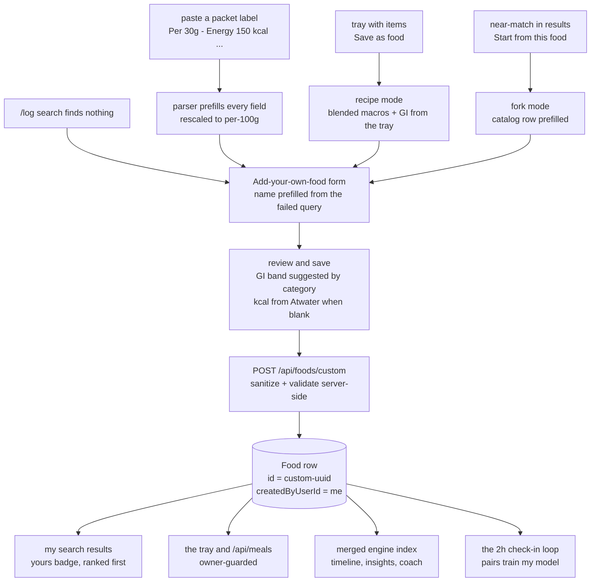
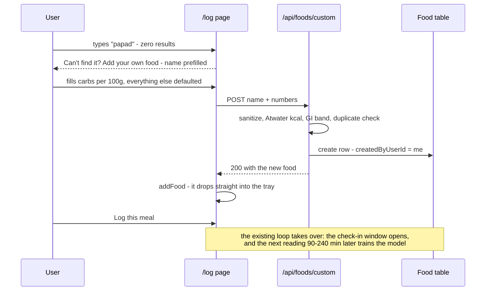
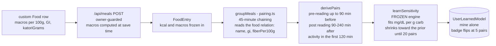
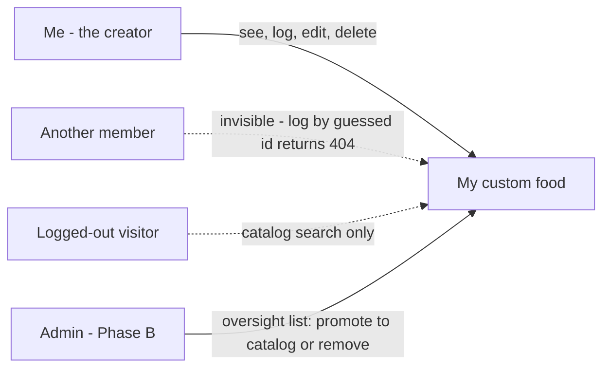
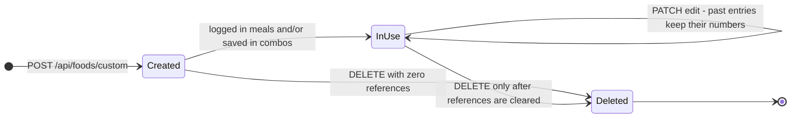

# My Kitchen - Custom Foods v2 - Feature Specification

> Status: design approved for build. Base commit 8b3fa12. Schema carried by
> migration 0002 (Food.createdByUserId, already applied in Turso) - v2 adds
> ZERO further migrations. Engine (@mi/engine) untouched; all new logic is
> app-side. Educational product - not medical advice.

> Viewing the diagrams: every mermaid block below renders as a real diagram
> on GitHub. Open this file on github.com after commit to see them as images.

## 1. Product story

The catalog ships 139 foods across 11 Indian cuisines. But real kitchens run
on specifics: your household idli batter, the pickle on your shelf, this
brand of papad, Sunday's thali. v1 of custom foods was an escape hatch for
when search failed. v2 makes anything from your kitchen a first-class,
searchable, model-aware food - created in under 30 seconds, because the
logging law applies to food creation too.

The four journeys this feature set must satisfy:

| # | Journey | Example |
|---|---------|---------|
| J1 | Household staple with its own character | my idli batter, with its own GI |
| J2 | Packet label in hand | Maggi, Marie Gold, bhujia - paste the nutrition line |
| J3 | A whole plate as one item | thali, batter, a homemade mix built from the tray |
| J4 | Near-match variant | fork catalog dosa into my ghee-roast dosa |

At a glance (plain-text map):

```
  four ways in                  one endpoint                   everywhere it matters
  ----------------------------   ----------------------------   ----------------------------------------------
  search miss / packet label  -> POST /api/foods/custom      -> my search results (yours badge, ranked first)
  tray recipe / fork catalog    (sanitize, validate,            the tray and meal logging (owner-guarded)
                               owner-scoped row)               dashboard timeline, insights, AI coach
                                                                the 2h check-in loop -> trains MY model
```

## 2. Feature list - 9 features across 6 commits

| # | Feature | What the user gets | Commit |
|---|---------|--------------------|--------|
| F1 | Core creation form | Name is the only required field. GI band chips (Low 40 / Medium 55 / High 70 / Very high 85) with an optional exact number 1-100. kcal auto-computed from macros (Atwater) when blank. Comma-separated aliases. | C1+C2 |
| F2 | Label paste-parser | Paste any packet's nutrition line; the form prefills carbs, protein, fat, fiber and kcal - rescaling per-Xg to per-100g, converting kJ, and flagging when the basis had to be assumed. | C3 |
| F3 | Recipe builder | "Save as food" beside "Save as combo": turns the current tray into ONE blended food. The blended GI mirrors pairing.ts math exactly, so tray preview, saved entry and model all agree. | C3 |
| F4 | Fork from catalog | "Start from an existing food" mini-search prefills the form from a catalog row; tweak and save as mine. | C3 |
| F5 | My Foods manager | /my-foods page: every food I created, times logged, edit (history keeps its old numbers), delete with plain-language reasons when blocked. | C4 |
| F6 | Search integration | Catalog + mine visible to me (yours badge, mine ranked first); a "Mine" chip; the placeholder stops hardcoding 139; a similar-name assist offers a fork instead of a duplicate. | C2 |
| F7 | Portion memory | Adding a food defaults to my last-used portion ("last time: 2 katori") - a default, never a requirement. | C2 |
| F8 | Engine-index merge | My foods appear in dashboard timeline labels, insights and AI coach answers - the merged index is still an engine-shaped parameter, so the engine stays frozen. | C1 |
| F9 | Hinglish aliases | The aliases field is surfaced as "also searchable as" (chawal, Anna, atta...) and matched by search. | C2 |
## 3. Diagrams

### 3.1 The four journeys - how a custom food is born



### 3.2 The 30-second path



### 3.3 A custom food trains YOUR model - existing machinery, unchanged



### 3.4 Who can see what - privacy



| Actor | Catalog foods | My custom foods | Someone else's custom foods |
|---|---|---|---|
| Me (creator) | see + log | see + log + edit + delete | invisible |
| Another member | see + log | invisible; logging by guessed id returns 404 | same |
| Admin (Phase B) | manage | oversight only: list, promote, remove | same |
| Logged-out visitor | search catalog only | invisible | invisible |

### 3.5 Lifecycle of a custom food



DELETE while the food is referenced returns 409 with the exact counts
("logged 12 times, used in 2 combos") - the honest, no-DDL answer to a
foreign-key constraint.

## 4. API reference (all no-DDL)

| Endpoint | Method | Guard | Behavior |
|---|---|---|---|
| /api/foods/custom | POST | session | create; sanitize + validate (section 5); id = custom- + uuid; 409 on exact own-name match; cap 100 per user |
| /api/foods/custom | GET | session | my foods plus useCount (entry groupBy) for the manager page |
| /api/foods/custom | PATCH | session + owner | edit any field, same validation; past FoodEntries keep their stored numbers |
| /api/foods/custom?id= | DELETE | session + owner | 409 with entry + combo counts while referenced; otherwise delete |
| /api/foods | GET | optional session | visibility: catalog OR mine (mine=1 = only mine); logged-out = catalog only |
| /api/meals | POST | session + owner guard | someone else's custom foodId returns 404 |

## 5. Server-side validation (source of truth)

| Field | Rule | Default when absent |
|---|---|---|
| name | trim, collapse whitespace, strip control characters, 2-60 chars - required | - |
| category | one of the 13 FoodCategory values | snack |
| region | one of the 11 CuisineRegion values | the user's profile region |
| servingGrams | finite, 1-2000 | 100 |
| katoriGrams | finite, 1-2000, optional | null (no katori portion option) |
| carbs / protein / fat / fiber per 100g | each finite, 0-100 | 0 |
| kcalPer100g | finite, 0-900, optional | Atwater: 4c + 4p + 9f |
| gi | finite, 1-100 - zero is unrepresentable by design | 55 |
| aliases | comma-split, max 5, each trimmed to 40 chars | null |

Why GI can never be 0 here: a 0-GI item inside a 45-minute meal group
dilutes the group's weighted GI (skewing every prediction for that meal)
and is excluded from model training (pairs require a positive GI). Bands
keep the defaults honest; the 2-hour check-ins learn the truth.

## 6. Files touched per commit

| Commit | New files | Edited files |
|---|---|---|
| C1 server core | api/foods/custom/route.ts, lib/food-index.ts | api/foods/route.ts (visibility + mine), api/meals/route.ts (owner guard), lib/engine-service.ts (merged index), api/coach/route.ts (merged index) |
| C2 form + search UX | components/AddCustomFood.tsx | app/log/page.tsx (empty state, quiet link, badge, Mine chip, mine-first sort, placeholder fix, portion memory) |
| C3 accelerators | - | AddCustomFood.tsx (paste-parser, fork mini-search), log/page.tsx (Save as food) |
| C4 manager | app/my-foods/page.tsx | components/AppShell.tsx (nav link after Log a meal) |
| C5 smoke | - | scripts/qa-smoke.mjs (12 to 21 checks, second cookie jar) |
| C6 docs | - | docs/PHASE2-STATUS.md (refresh, hash-backed) |

## 7. QA plan - 12 to 21 checks

13. demo creates "Smoke Batter" plus a timestamp suffix: 200, id starts custom-, owner is demo.
14. demo search finds it.
15. priya's session searches the same term: NOT found (the load-bearing privacy check).
16. mine=1 lists it and excludes catalog foods.
17. demo logs a back-timed meal with it; macros match carbs x grams / 100.
18. demo PATCHes the food; the list reflects the new value.
19. DELETE returns 409 with counts (the entry from 17 is the reference).
20. delete the entry, then the food: 200; search confirms gone.
21. a second create with recipe-computed numbers; search; delete.

Demo-state safety holds: zero glucose writes anywhere; every entry and food
is cleaned up; the 3-of-5 pair count and pending check-ins are untouched.

## 8. How this honors the product laws

- Promptless principle: only the name is required; every other field carries
  a default; the similar-name assist suggests, never blocks; portion memory
  changes a default, never demands anything.
- Under 30 seconds: query prefill, Atwater kcal, GI bands, the paste-parser,
  the fork. Creating a food should feel like logging one.
- Data, not a grade: GI is labeled a starting guess; no red badges for blank
  fields; the form never nags.
- Whatever exists is enough: a name-only food still logs and trends; it just
  will not train the model until it carries a real GI and enough carbs.
- Privacy by default (DPDP posture): private to the creator, invisible in
  others' searches, 404 on foreign logging, reversible deletion, no
  third-party data flows.
- Engine frozen: the only engine-adjacent change is feeding an existing
  parameter (foodIndex) a merged map; the 67-test suite remains the gate.
- Smallest diffs: six commits, each independently shippable, each gated by
  npm test 67/67 plus a green build before push.

## 9. Education and privacy boundary

- Every GI and macro number here is an educational estimate; the app never
  claims clinical precision for a user-entered value.
- The honest loop - "your 2-hour check-ins learn your real response" - is
  the educational frame for every prediction a custom food feeds.
- Label parsing is arithmetic on a user-supplied string; it never
  interprets, recommends, or diagnoses.
- The standard educational disclaimer rides the tray prediction line
  exactly as it does today; no new advice surfaces are introduced.

## 10. Explicitly deferred (with reasons)

| Idea | Why deferred |
|---|---|
| Barcode scan / OCR | new dependencies + third-party product APIs = external data flows (DPDP posture); the paste-parser captures most of the value at zero risk |
| Sharing customs with family or caregivers | private-to-creator is a stated privacy law; any sharing is consent-based future work |
| Ingredient lists, tags, per-food photos, archive | all need DDL - queued as one-line items on the Phase C migration wishlist |
| Community catalog / voting | admin promote-to-catalog (Phase B) is the sanctioned path |
| JSON import / export | belongs to the later export/delete phase |

## 11. Decisions already taken (veto-able until C1 merges)

- GI bands 40 / 55 / 70 / 85 with Medium (55) preselected; exact override 1-100.
- Cap: 100 custom foods per user.
- Exact own-name duplicate returns 409; duplicates against catalog names stay
  allowed (my batter next to catalog idli is the point).
- Page name "My Foods" at /my-foods; nav link placed right after Log a meal.
- Portion memory ships in C2.
- Recipe servingGrams defaults to the full tray's gram total (editable).

---
End of specification. Build order C1 to C6; gates per commit: npm test 67/67
and a green build; live verification per the browser checklists after each
push.
